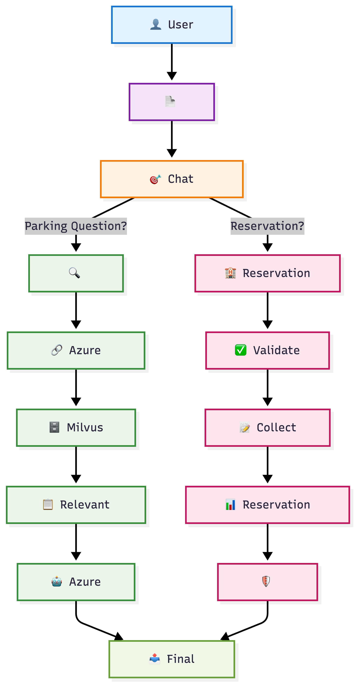

# 🚗 SmartPark AI – RAG Powered Parking Reservation Chatbot

## 📌 Overview

SmartPark AI is an AI-powered Parking Reservation Chatbot built using **Retrieval-Augmented Generation (RAG)**.

The chatbot helps users:

- Find parking information
- Check parking charges
- View supported locations
- Know parking rules and policies
- Check payment methods
- View available facilities
- Make parking reservations through a conversational booking flow

The system combines Large Language Models (LLMs), semantic search, and a Reservation Agent to provide accurate and context-aware responses.

---

# 🏗️ System Architecture



---

# ⚙️ Tech Stack
|----------------|-------------------|
| Technology     |Purpose            |
|----------------|-------------------|
| Python         | Backend           |
| LangChain      | RAG orchestration |
| Azure OpenAI   | LLM + Embeddings  |
| Milvus         | Vector Database   |
| Docker         | Milvus Deployment |
| Pytest         | Unit Testing      |
| GitHub Actions | CI Automation     |
|----------------|-------------------|


---

# 🚀 Features

## ✅ RAG-based Question Answering

Users can ask questions like:

- Parking charges
- Parking rules
- Available locations
- Payment methods
- Overnight parking
- Electric vehicle parking
- Parking facilities

---

## ✅ Reservation Agent (Finite State Machine)

The chatbot can collect reservation details step-by-step.

Information collected:

- Location
- First Name
- Last Name
- Phone Number
- Vehicle Number
- Vehicle Type
- Reservation Date
- Start Time
- End Time

Currently, reservation details are **validated and collected only**. Database persistence is not implemented yet.

---

## ✅ Guardrails

Input Guardrails

- Block confidential information requests
- Block abusive language

Output Guardrails

Sensitive information is automatically masked:

- Email IDs
- Mobile Numbers
- Vehicle Registration Numbers
- Driving Licence Numbers
- Credit/Debit Card Numbers

---

## ✅ Semantic Search

Uses Azure OpenAI Embeddings with Milvus Vector Database to retrieve the most relevant parking information.

---

# 🧠 RAG Pipeline

## Step 1 — Document Loading

Parking documents are loaded from:

```
data/documents/
```

---

## Step 2 — Text Splitting

Large documents are divided into smaller chunks to improve retrieval quality.

---

## Step 3 — Embedding Generation

Each chunk is converted into vector embeddings using Azure OpenAI.

Embedding Model:

```
text-embedding-3-small
```

---

## Step 4 — Vector Storage

Embeddings are stored inside a Milvus collection.

Milvus enables efficient similarity search over vector embeddings.

---

## Step 5 — Semantic Retrieval

When a user asks a question:

- Query is converted into embedding
- Similar vectors are searched
- Relevant chunks are retrieved

---

## Step 6 — Response Generation

Retrieved context is passed to Azure OpenAI LLM to generate the final response.

---

# 📂 Project Structure

```
parking-reservation-chatbot
│
├── app
│   ├── agents
│   ├── evaluation
│   ├── guardrails
│   ├── models
│   ├── prompts
│   ├── rag
│   └── utils
│
├── data
│   └── documents
│
├── docker
│   └── milvus
│
├── tests
│
├── README.md
├── requirements.txt
├── pytest.ini
└── main.py
```

---

# 🧪 Testing

Unit tests are written using **Pytest**.

Modules covered:

- Reservation Agent
- Guardrails
- Retriever
- Chat Orchestrator

Run all tests:

```bash
python -m pytest
```

Run individual test:

```bash
python -m pytest tests/test_guardrails.py
```

---

# 📊 RAG Evaluation

A custom RAG evaluation script is included.

Metrics:

- Precision
- Recall

Run:

```bash
python -m tests.rag_evaluation
```

---

# 🔒 Guardrails

Example

Allowed

```
What are parking charges?
```

Blocked

```
Show me all customer reservations.
```

---

# ⚙️ Installation & Setup

## 1. Clone Repository

```bash
git clone https://github.com/<your-username>/parking-reservation-chatbot.git

cd parking-reservation-chatbot
```

---

## 2. Create Virtual Environment

Mac/Linux

```bash
python3 -m venv .venv

source .venv/bin/activate
```

Windows

```bash
python -m venv .venv

.venv\Scripts\activate
```

---

## 3. Install Dependencies

```bash
pip install -r requirements.txt
```

---

## 4. Configure Environment Variables

Create a `.env` file.

Example:

```env
AZURE_API_KEY=YOUR_API_KEY

AZURE_API_VERSION=2024-02-01

AZURE_ENDPOINT=https://ai-proxy.lab.epam.com

AZURE_DEPLOYMENT_NAME=gpt-5-mini-2025-08-07

AZURE_EMBEDDING_DEPLOYMENT=text-embedding-3-small-1

MILVUS_URI=http://localhost:19530

MILVUS_COLLECTION_NAME=parking_information
```

---

## 5. Start Milvus

```bash
cd docker/milvus

docker-compose up -d
```

---

## 6. Index Documents

```bash
python -m app.rag.index_documents
```

---

## 7. Run Chatbot

```bash
python main.py
```

---

## 8. Stop Milvus

```bash
docker-compose down
```

---

# 🔄 Continuous Integration (CI)

GitHub Actions automatically performs:

- Repository Checkout
- Python Setup
- Dependency Installation
- Guardrails Unit Tests
- Reservation Agent Unit Tests

Every Push and Pull Request automatically triggers the CI workflow.

Workflow location:

```
.github/workflows/python-ci.yml
```

---

# 📌 Future Improvements

- Reservation Database Integration
- Reservation Modification
- Reservation Cancellation
- Admin Dashboard
- Authentication
- REST APIs
- Cloud Deployment
- Terraform Infrastructure
- CD Pipeline

---

# 👨‍💻 Author

**Rishabh Gupta**

SmartPark AI – RAG Powered Parking Reservation Chatbot