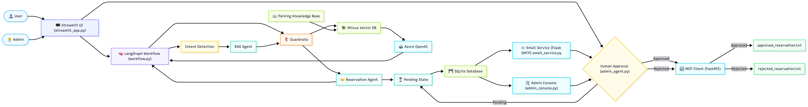

# 🚗 SmartPark AI

> AI-powered Parking Reservation System built using LangGraph,
> LangChain, Azure OpenAI, Milvus, SQLite, Streamlit, Flask and MCP.

## ✨ Features

- **Conversational Parking Assistant**  
  AI-powered chatbot that allows users to interact in natural language for parking-related queries and reservations.

- **RAG-Powered Knowledge Retrieval**  
  Uses Retrieval-Augmented Generation (RAG) with Milvus Vector Database to provide accurate answers about parking policies, pricing, locations, FAQs, and operating hours.

- **Parking Reservation Workflow**  
  Guides users through a complete reservation process, validates user details, allocates an available parking slot, and stores reservation information in SQLite.

- **Human-in-the-Loop Admin Approval**  
  Every reservation is initially marked as **Pending** and requires manual approval or rejection by an administrator before confirmation.

- **Admin Dashboard**  
  Streamlit-based dashboard that enables administrators to view **Pending**, **Approved**, and **Rejected** reservations, approve or reject requests, and revert reservations back to pending when required.

- **Email Notifications**  
  Automatically sends email notifications for reservation approval, rejection, and administrator alerts using Gmail SMTP integration.

- **MCP Synchronization**  
  Synchronizes reservation data with the MCP server after every reservation status change, ensuring external systems remain up to date.

- **Guardrails & Data Masking**  
  Protects sensitive user information by validating inputs and masking confidential data such as phone numbers, vehicle numbers, and driving licence numbers in logs and administrator views.

- **Application Logging**  
  Maintains structured logs for reservation requests, approvals, rejections, MCP synchronization, and system events for monitoring and debugging.

- **Automated Testing**  
  Supports unit and integration testing using **Pytest** to validate application functionality and maintain code quality.

- **Dockerized Milvus Deployment**  
  Runs Milvus Vector Database using Docker Compose, enabling simple deployment without requiring a local database installation.

- **GitHub Actions CI/CD Ready**  
  Includes a GitHub Actions workflow for automated dependency installation, code quality checks, and test execution on every push or pull request.

## Architecture




## ⚙️ Tech Stack

| **Layer** | **Technology** |
|:----------|:---------------|
| UI | Streamlit |
| Workflow | LangGraph |
| LLM | Azure OpenAI |
| Framework | LangChain |
| Vector DB | Milvus |
| Database | SQLite |
| API | Flask |
| Email | SMTP |
| Testing | Pytest |
| CI/CD | GitHub Actions |
| Container | Docker |

## Project Structure

``` text
.
├── README.md
├── __pycache__
│   └── run_graph.cpython-312.pyc
├── app
│   ├── __init__.py
│   ├── __pycache__
│   ├── agents
│   ├── api
│   ├── database
│   ├── evaluation
│   ├── graph
│   ├── guardrails
│   ├── mcp
│   ├── models
│   ├── prompts
│   ├── rag
│   ├── ui_app
│   └── utils
├── data
│   ├── documents
│   ├── parking.db
│   ├── reservations
│   └── sample_data
├── database
│   └── parking.db
├── docker
│   └── milvus
├── docs
│   ├── PPTX
│   ├── architecture
│   ├── evaluation_reports
│   └── screenshots
├── langgraph.json
├── logs
│   └── smartpark.log
├── main.py
├── misc_scripts
│   ├── __pycache__
│   ├── admin_console.py
│   ├── admin_test.py
│   ├── chat_orchestrator_workling.py
│   ├── generate_ppt.py
│   ├── main_backup.py
│   ├── main_test_run.py
│   ├── milvus_test_run.py
│   ├── requirements_current.txt
│   ├── reservation_agent_working_backup.py
│   ├── streamlit_app.py
│   ├── test_dns.py
│   ├── test_email.py
│   └── test_email_ssl.py
├── pyproject.toml
├── pytest.ini
├── requirements.txt
├── run_graph.py
├── storage
└── tests
    ├── __pycache__
    ├── conftest.py
    ├── test_admin_agent.py
    ├── test_chat_orchestrator.py
    ├── test_email_service.py
    ├── test_fastAPI_mcp_server.py
    ├── test_guardrails.py
    ├── test_langgraph_workflow.py
    ├── test_load.py
    ├── test_reservation_agent.py
    ├── test_retriever.py
    ├── test_sqlite_client.py
    └── test_streamlit_ui.py
```

## Installation

``` bash
git clone https://github.com/rishabhjhs56/parking-reservation-chatbot.git
cd parking-reservation-chatbot
python -m venv .venv
source .venv/bin/activate
pip install -r requirements.txt
```

## Environment Variables

Create `.env`

``` env
AZURE_API_KEY=
AZURE_API_VERSION=
AZURE_ENDPOINT=
AZURE_DEPLOYMENT_NAME=
AZURE_EMBEDDING_DEPLOYMENT=
MILVUS_URI=
MILVUS_COLLECTION_NAME=
EMAIL_ADDRESS=
EMAIL_PASSWORD=
ADMIN_EMAIL=
FASTAPI_MCP_API_KEY =
FASTAPI_MCP_URL=
LANGSMITH_API_KEY=
LANGSMITH_TRACING=
LANGSMITH_PROJECT=
LANGSMITH_ENDPOINT=
ADMIN_PANEL_PASSWORD=

```

## Start Services

### 1. Start Milvus

``` bash
cd docker/milvus
docker-compose up -d
```

### 2. Initialize Database

``` bash
python -m app.database.init_db
python -m app.database.seed_slots
```

### 3. Index Documents

``` bash
python -m app.rag.index_documents
```

### 4. Start Server

#### 4a.  Start Flask API (For Email Sevice)

``` bash
python -m app.api.admin_api
```
#### 4a.  Start MCP Server (FastAPI)

``` bash
uvicorn app.mcp.server:app --reload
```


### 5. Run Langraph workflow

``` bash
python -m run_graph.py
```

### 5a. Run Chatbot (Without LangGraph)

``` bash
python -m main.py
```

### 5b. Admin Console (Through Terminal)

``` bash
python -m misc_scripts.admin_console
```

### 6. Launch Streamlit

``` bash
python -m streamlit run app/ui_app/streamlit_app.py
```

## User Workflow

1.  Open User Chat
2.  Ask parking questions
3.  Book parking
4.  Reservation saved as **PENDING**
5.  Admin reviews request
6.  User receives email after approval/rejection

## Admin Dashboard

-   View Pending reservations
-   Approve reservations
-   Reject reservations
-   Move Approved/Rejected back to Pending
-   Automatic MCP synchronization
-   Automatic email notification


## Reservation Storage (MCP Server - FastAPI)

| **Reservation Status** | **Storage Location** |
|:-----------------------|:---------------------|
| Approved Reservations | `data/reservations/approved_reservations.txt` |
| Rejected Reservations | `data/reservations/rejected_reservations.txt` |

## Testing

### 1. Run Automated Tests

``` bash
python -m pytest -v
```

### 2. Run RAG Evaulation Report

``` bash
python -m app.evaluation.rag_evaluation
```
Evaluation report is saved in:
docs/evaluation_reports/rag_evaluation_report.txt


## Logs

Application logs are stored under:

``` text
logs/
```

## CI/CD

GitHub Actions pipeline can execute:

-   Install dependencies
-   Run Pytest
-   Build validation

## 🛠️ Troubleshooting

| **Issue** | **Solution** |
|:----------|:-------------|
| Docker not running | Start Docker Desktop |
| Milvus connection error | Verify Docker containers are running |
| SQLite locked | Close other database connections |
| SMTP failure | Verify email credentials and App Password |
| Port already in use | Stop the existing process. Example: `kill -9 $(lsof -ti:8000)` |

## Future Enhancements

-   TBD

## Author

Rishabh Gupta (EPAM- Senior Data Quality Engineer)
